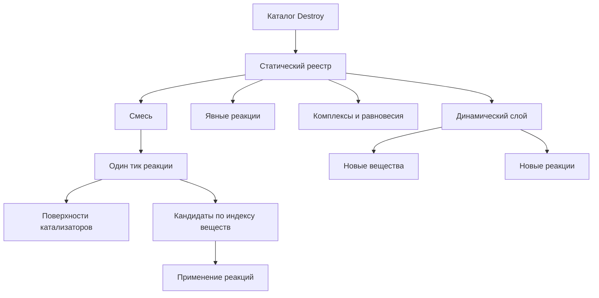

# Химическая модель

Эта карта объясняет Rust-ядро химии без Minecraft-слоя. Начинать лучше отсюда, а не с отдельных файлов кода.

## Что читать по порядку

1. [[01-entities|Сущности модели]]
2. [[02-static-catalog-and-registry|Каталог и реестр]]
3. [[03-mixture-tick-flow|Один тик смеси]]
4. [[04-dynamic-substances-and-generation|Динамические вещества и реакции]]
5. [[05-molecular-graph-and-frowns|Граф молекулы и FROWNS]]
6. [[06-invariants-and-errors|Запрещенные состояния и проверки]]
7. [[07-code-map|Карта кода]]

Подробные постраничные описания каждого файла нативной части лежат в `files/` и доступны через [[07-code-map|Карту кода]].

## Главные входы

- Статический каталог Destroy: `destroy_registry_builder`
- Каталог с органическими генераторами: `destroy_registry_with_generated_reactions_builder`
- Динамический слой: `DynamicChemistryRegistry`
- Расчет реакции в смеси: `react_for_tick_with_context`

## Общая форма модели

## Правило чтения кода

Сначала читай публичные входы и типы данных, потом внутренние проверки. В этой модели важнее поток данных, чем отдельные функции.
