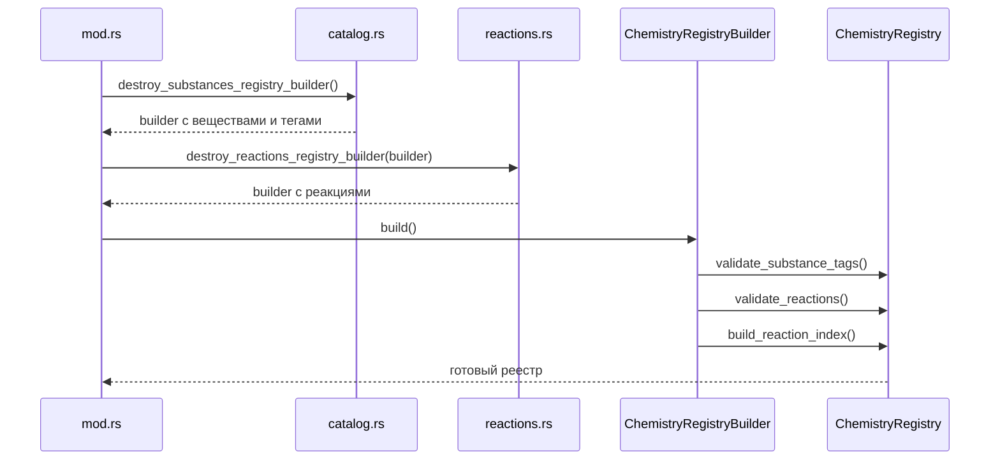

# Каталог и реестр

## Каталог

Каталог - это исходные данные Destroy: вещества, теги, явные реакции и свойства.

Код:

- `catalog.rs`
- `destroy_reactions.generated.rs`
- `reactions.rs`

Каталог сам по себе не рассчитывает смесь. Он только наполняет построитель реестра.

## Реестр

Реестр - это проверенная, готовая к расчету форма данных.

Код: `registry.rs`

При сборке реестр:

- проверяет вещества;
- проверяет реакции;
- проверяет, что все ссылки на вещества существуют;
- проверяет сохранение массы и заряда;
- проверяет обратные пары реакций;
- строит индекс реакций по веществам.

## Поток сборки

## Каталог против реестра

Каталог отвечает на вопрос: “что известно из Destroy?”

Реестр отвечает на вопрос: “какие проверенные данные можно использовать в расчете?”

Это разделение важно: ошибка в данных должна проявиться при сборке реестра, а не во время тика смеси.
