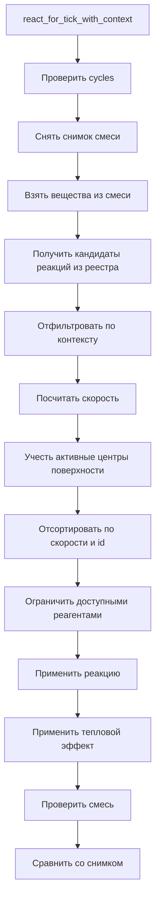

# Один тик смеси

Главный вход расчета: `react_for_tick_with_context`.

Упрощенный поток:

## Кандидаты реакций

Смесь не перебирает весь реестр. Она отдает свои вещества в:

`reaction_candidates_for_substances`

Реестр возвращает реакции, где вещество участвует как реагент или входит в порядок реакции.

Это важно для быстрого тика: смесь с малым количеством веществ не должна считать скорости всех реакций Destroy.

## Контекст реакции

Контекст описан в `ReactionContext`.

Он хранит:

- мощность ультрафиолета;
- внешние реагенты;
- поверхности катализаторов;
- старые внешние катализаторы как короткий путь создания простой поверхности;
- накопленные результаты реакций.

Контекст не зависит от Minecraft. Игровой слой позже сможет перевести предметы и условия в этот чистый тип.

## Применение реакции

Применение делает `apply_reaction`:

- уменьшает концентрации реагентов;
- увеличивает концентрации продуктов;
- расходует внешние реагенты;
- проверяет и обновляет состояние поверхностей катализаторов;
- записывает результаты реакции;
- записывает поверхностные шаги;
- применяет тепловой эффект через `Mixture::heat`.

## Проверки после тика

После каждого цикла смесь проходит `Mixture::validate`.

Запрещены:

- отрицательные концентрации ниже следового порога;
- `NaN`;
- бесконечности;
- газовая доля вне `0.0..=1.0`;
- газовая доля у вещества, которого нет в смеси.
