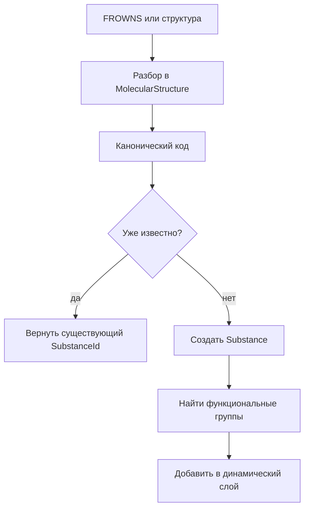
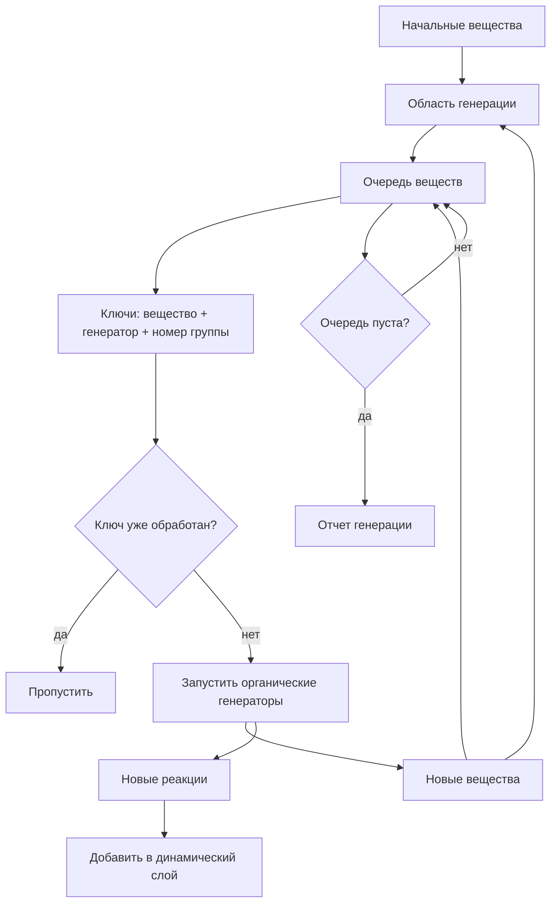

# Динамические вещества и реакции

Динамический слой нужен, чтобы модель могла работать не только с 152 веществами Destroy, но и с новыми структурами.

Код: `dynamic.rs`

## Разрешение вещества

Главные входы:

- `resolve_frowns`
- `resolve_structure`

Поток:

Если структура совпадает со статическим веществом, возвращается его исходный идентификатор, например `destroy:acetone`.

## Генерация реакций

Главные входы:

- `generate_reactions_for`
- `generate_reactions_for_to_fixed_point`
- `generate_reactions_for_substances`
- `generate_reactions_for_substances_to_fixed_point`

Нормальный путь - генерировать реакции для веществ текущей области, а не для всего каталога.

## Область генерации

Область генерации - это множество веществ, которые считаются доступными для парных генераторов.

Пример: этерификация ищет кислоту и спирт. Если в области есть только кислота, спирт из полного каталога не подтягивается сам по себе. Если в области есть кислота и спирт, реакция создается.

Это защищает модель от ложной генерации “все со всем”.

## Что кешируется

Динамический слой хранит:

- новые вещества;
- новые реакции;
- соответствие канонического кода веществу;
- индексы реакций по веществам;
- обработанные задания генерации.

Обработанное задание теперь компактное: индекс вещества, вид генератора и номер функциональной группы.

## Аварийные ограничения

Ограничения на очередь и число заданий не являются обычным способом завершения. Нормальное завершение - пустая очередь. Если ограничение сработало, это ошибка алгоритма или слишком широкая область генерации.
