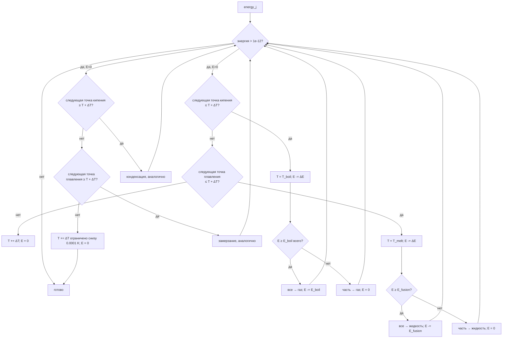

# Mixture — многофазная химическая смесь

Исходный код: `core/mixture.rs`

## Назначение

`Mixture` — центральный рабочий объект симуляции. Это «реактор»: он хранит
текущие количества веществ по фазам (моль/ведро), температуру и объём
газовой фазы, обрабатывает нагрев со сменой фаз, растворимость,
испарение/конденсацию, растворение газов и обмен с атмосферой.
Все операции атомарны: каждый pub-метод завершается вызовом `validate()`.

## Ключевые типы

### `MixturePhase`

Перечисление из 6 фаз:

| Вариант | Смысл |
|---|---|
| `Aqueous` | водная фаза (единая, без привязки к растворителю) |
| `Organic` | органическая фаза; каждое вещество хранится по ключу-растворителю |
| `MoltenMetal` | расплав металла; аналогично по растворителю-анкеру |
| `MoltenSlag` | расплав шлака; аналогично |
| `Gas` | газовая фаза |
| `Solid` | твёрдый осадок |

`Aqueous` и `Gas` — «одиночные»; `Organic`, `MoltenMetal`, `MoltenSlag`
требуют конкретного «анкера» — вещества-растворителя, которое
сформировало эту жидкую фазу.

### `Mixture`

```rust
pub struct Mixture {
    temperature_kelvin: f64,
    gas_volume_cubic_meters: f64,     // DEFAULT = 0.001 м³
    components: Vec<MixtureComponent>,
    positions_by_substance: Vec<Option<usize>>, // индекс → позиция
}
```

### `MixtureComponent` (приватный)

На каждое присутствующее вещество один компонент:

```rust
struct MixtureComponent {
    substance: SubstanceIndex,
    substance_id: SubstanceId,
    aqueous_mol_per_bucket: f64,
    organic_mol_per_bucket_by_solvent: BTreeMap<SubstanceIndex, f64>,
    molten_metal_mol_per_bucket_by_solvent: BTreeMap<SubstanceIndex, f64>,
    molten_slag_mol_per_bucket_by_solvent: BTreeMap<SubstanceIndex, f64>,
    gas_mol_per_bucket: f64,
    solid_mol_per_bucket: f64,
}
```

Полное количество вещества = сумма по всем картам и скалярным полям.

### `LiquidPhaseSnapshot` / `LiquidPhaseSubstanceAmount`

Публичные срезы для JNI-слоя: описывают конкретную жидкую фазу
(её идентификатор `LiquidPhaseId`, тип `coarse_phase`,
представительный растворитель и состав).

### `MixtureCheckpoint` (pub(crate))

Снимок температуры, объёма и предыдущих компонентов для отката реакции.

## Публичные входы

### Создание и базовые аксессоры

- `Mixture::new(T)` — пустая смесь при температуре T (K ≥ 0, конечное).
- `Mixture::empty()` — при `DEFAULT_TEMPERATURE_KELVIN = 298.0`.
- `temperature_kelvin()`, `gas_volume_cubic_meters()`.
- `set_gas_volume_cubic_meters(v)` — меняет объём headspace; v > 0.

### Запросы концентраций

- `concentration_of(id)` — суммарное количество по всем фазам (моль/ведро).
- `concentration_in_phase(id, phase)` — количество в конкретной фазе.
- `total_concentration_in_phase(phase)` — сумма по всем веществам в фазе.
- `gaseous_fraction_of(id)` — доля газовой фазы (0..=1).
- `phase_amounts_of(id)` → `Vec<PhaseAmount>` по всем 6 фазам.
- `organic_phase_amounts_of(registry, id)` → список с указанием растворителя.
- `concentration_in_organic_solvent(registry, id, solvent_id)`.

### Жидкие фазы

- `liquid_phase_count(registry)` — число отдельных жидких фаз.
- `liquid_phase_snapshots(registry)` — публичные снимки всех жидких фаз.
- `liquid_phase_amounts_of(registry, id)` — количество вещества в каждой жидкой фазе.
- `liquid_phase_ionic_strengths(registry)` — ионная сила I = ½ Σ cᵢzᵢ² по фазе.
- `aqueous_ionic_strength(registry)` — то же только для водной фазы.

### Давление газа

- `gas_pressure_pascal()` — суммарное P = n·R·T / V (идеальный газ).
- `gas_partial_pressure_pascal(id)` — парциальное давление компонента.

### Растворение

- `activity_of(registry, id, phase)` → делегирует в [[core-solution|solution]].
- `ph(registry)` / `solution_state(registry)` / `aqueous_equilibrium_systems(registry)`.
- `equilibrate_solution(registry)` — итерирует кислотно-основные равновесия.

### Изменение состава

- `add_substance(registry, id, mol)` — добавляет вещество; начальная фаза
  определяется по температуре (`initial_phase_for_substance`). Запрещены
  `destroy:hypothetical`-вещества.
- `change_concentration(registry, id, Δ)` — изменяет на Δ (может быть < 0).
  Удаляет компонент, если результат ≤ `TRACE_CONCENTRATION_MOL_PER_BUCKET`.
- `set_gaseous_fraction(registry, id, f)` — перераспределяет вещество между
  газом и предпочтительной жидкой фазой в пропорции `f`.
- `move_between_phases(registry, id, from, to, mol)` — прямой перенос.

### Нагрев

`heat(registry, energy_j_per_bucket)` — добавляет (или отнимает) энергию.
Алгоритм описан подробно ниже.

### Смешивание

`Mixture::mix(registry, &[(mixture, amount)])` — статический конструктор.
Взвешенно суммирует количества по фазам, усредняет объём headspace,
вычисляет суммарную тепловую энергию (включая теплоту для газовых
молей), создаёт пустую смесь и вызывает `heat(total_energy/total_amount)`.

### Газовый обмен

- `transfer_gases_toward_solubility_equilibrium(registry, ticks)` —
  растворяет/выделяет газы по закону Генри с экспоненциальным затуханием.
- `exchange_gases_with_atmosphere(registry, fractions, P_total, k, ticks)` —
  обменивается молями газа с заданной атмосферой (Σ fraction ≤ 1).

### Фазовое равновесие

- `equilibrate_phases(registry)` — запускает `redistribute_condensed_phases`
  + `equilibrate_vapor_liquid`; гарантирует сохранение количества вещества.
- `equilibrate_vapor_liquid(registry)` — по давлению пара каждого компонента
  перераспределяет между газом и жидкостью.

### Реакционные хелперы (pub(crate))

- `apply_reaction_phase_deltas_by_index` — уменьшает реагенты, увеличивает продукты.
- `checkpoint_for_reaction` / `restore_checkpoint` — снапшот и откат.
- `apply_aqueous_targets_by_index` — прямая запись целевых водных концентраций
  (используется решателем равновесий раствора).

## Поток данных / Алгоритм

### Нагрев — детали



Итерация ограничена 10 000 шагами; превышение → `InvalidMixtureState("heating did not converge")`.

### Распределение по жидким фазам

`redistribute_condensed_phases` при каждом `equilibrate_phases`:

1. Строит список жидких фаз через `solvent_clusters` (кластеризация
   растворителей по мисцибельности).
2. Для каждого вещества вычисляет допустимое количество в конденсированных
   фазах (`condensed_solubility_capacity`).
3. Вызывает `distribute_condensed_amount` — сортирует фазы по ёмкости
   (безграничная ёмкость — первая), заполняет по очереди.
4. Остаток, если `can_precipitate`, уходит в `Solid`; иначе — ошибка.

### Растворимость в смешанном растворителе

`mixed_phase_solubility_limit` — взвешенное геометрическое среднее логарифмов
лимитов по каждому растворителю пропорционально его мольной доле:

```
ln(limit_mix) = Σ(xᵢ · ln(limitᵢ)) / Σxᵢ
```

Если хоть один растворитель имеет `None` (безграничную растворимость),
результат тоже `None` (если таких растворителей большинство) или завышенный
конечный лимит (если есть и ограниченные).

### Классификация жидкой фазы

`classify_liquid_phase`: расплав металла или шлака определяется присутствием
соответствующих анкеров. Для водных/органических — порог: если доля воды ≥ 25 %
среди растворителей кластера, фаза считается `Aqueous`; иначе — `Organic`.

### Газовая растворимость (закон Генри)

```
dissolved = P_gas · H · √(T_ref/T) · exp(−b · I)
```

где `H` — константа Генри [моль/ведро/Па], `b` — коэффициент высаливания,
`I` — ионная сила водной фазы. Перенос газа за `ticks` тиков:

```
fraction = 1 − exp(−k · ticks)
moved = |target − current| · fraction
```

### Обмен с атмосферой

Для каждого газа в пересечении (текущий газ ∪ атмосферный):

```
target_moles = P_atm_partial · V / (R · T)
delta = (target − current) · (1 − exp(−k · ticks))
```

Добавленные молекулы идут в газовую фазу, убранные — изымаются из неё.

## Инварианты и ошибки

Все ошибки — `ChemistryError::InvalidMixtureState(String)`.

| Инвариант | Где проверяется |
|---|---|
| T ≥ 0, конечное | `new`, `validate`, `heat` |
| V > 0, конечное | `new`, `set_gas_volume_cubic_meters` |
| Все концентрации ≥ 0, конечные | `validate` по всем компонентам |
| Нет дублей веществ | `validate` |
| positions\_by\_substance согласован с компонентами | `validate` |
| Индексы не выходят за размер реестра | `validate_registry_shape` |
| Количество вещества сохраняется при `equilibrate_phases` | проверка до/после перераспределения |
| `IonicSolid` не попадает в атмосферный обмен (T-проверка) | `exchange_gases_with_atmosphere` |
| Атмосферные доли Σ ≤ 1 | `exchange_gases_with_atmosphere` |
| Нагрев сходится за ≤ 10 000 итераций | `heat` |

Пороги:
- `TRACE_CONCENTRATION_MOL_PER_BUCKET = 1/512²` ≈ 3.8 × 10⁻⁶ — порог удаления нейтральных компонентов.
- Ионы удаляются при концентрации ≤ 1 × 10⁻¹⁴ (аналог `[H⁺]` в нейтральной воде).

## Связи

- [[core-substance|Substance]] — фазовые предпочтения и термодинамические параметры
- [[core-registry|Registry]] — индексы, свойства в SOA-форме, мисцибельность, модели газовой растворимости
- [[core-solution|Solution]] — `equilibrate_solution`, `activity_of`, `solution_state`
- [[core-reaction|Reaction]] — использует `apply_reaction_phase_deltas_by_index` и checkpoint
- [[core-thermodynamics|Thermodynamics]] — использует T и `activity_of` из смеси
- [[core-simulation|Simulation]] — вызывает `heat`, `mix`, `add_substance`, `exchange_gases_with_atmosphere`
- [[jni-bindings|JNI]] — читает `liquid_phase_snapshots`, `gas_pressure_pascal`, `concentration_of`
