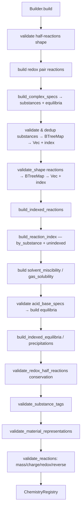

# Registry — реестр веществ и реакций

Исходный код: `core/registry.rs`

## Назначение

`ChemistryRegistry` — неизменяемый после построения каталог всего химического контента: вещества, реакции, растворимость, равновесия, осадки, redox-полуреакции, каталитические поверхности, комплексы. Центральный объект, передаваемый во все операции симуляции.

## Ключевые типы

`SubstanceIndex` / `ReactionIndex` — newtype-обёртки над `usize`. Используются вместо `SubstanceId`/`ReactionId` во внутренних hot-path структурах.

`SubstancePropertiesTable` — параллельные векторы физических свойств, индексированные `SubstanceIndex.0`. Позволяет читать заряд/массу/плотность/теплоёмкость через индекс без поиска по map.

`IndexedStoichiometricTerm` — `SubstanceIndex` + `coefficient` + `phases`. Индексированный аналог `StoichiometricTerm`.

`IndexedReaction` — полностью индексированная реакция: reactants/products/channels/distribution/orders — всё через `SubstanceIndex`.

`ReactionCandidateScratch` — переиспользуемый буфер для поиска кандидатов реакций без аллокаций. Использует поколение (`generation: u32`) вместо очистки вектора меток.

`SolventMiscibility` — `FullyMiscible | PartiallyMiscible { limit_mol_per_bucket } | Immiscible`. По умолчанию: `Immiscible` для любой пары, не указанной явно.

`GasSolubilityModel::Henry` — модель Генри с константой, температурой, коэффициентом высаливания и скоростью переноса.

`ChemistryRegistry` — главный реестр (см. поля ниже).

`ChemistryRegistryBuilder` — строитель; единственный способ создания `ChemistryRegistry`.

## Публичные входы (ChemistryRegistryBuilder)

| Метод | Что добавляет |
|---|---|
| `.substance(Substance)` | Вещество |
| `.reaction(Reaction)` | Реакция (прямая) |
| `.substance_tag(id)` | Допустимый тег вещества |
| `.solvent_miscibility(a, b, Miscibility)` | Смешиваемость растворителей |
| `.gas_solubility(id, Henry{...})` | Растворимость газа |
| `.acid_base_pair(AcidBaseSpec)` | Кислотно-основная пара |
| `.equilibrium(EquilibriumSpec)` | Равновесие в растворе |
| `.precipitation(PrecipitationSpec)` | Равновесие осадка |
| `.redox_half_reaction(RedoxHalfReaction)` | Полуреакция redox |
| `.redox_pair(RedoxPair)` | Готовая пара redox |
| `.redox_pair_from_halves(id, ox_id, red_id)` | Пара redox из двух полуреакций по id |
| `.catalyst_surface_spec(CatalystSurfaceSpec)` | Каталитическая поверхность |
| `.complex_spec(ComplexSpec)` | Комплексное соединение |
| `.build()` | → `ChemistryResult<ChemistryRegistry>` |

`ChemistryRegistryBuilder::from_registry(registry)` — клонирует содержимое существующего реестра, фильтруя автоматически сгенерированные равновесия (acid_base, neutralization, hydrolysis, complex).

## Поток данных / Алгоритм

`build_reaction_index` делит реакции на два класса:
- **indexed** — реакция имеет хотя бы один реагент или order → попадает в `reaction_index_by_substance[SubstanceIndex]`.
- **unindexed** — реакция без реагентов (чисто внешние) → попадает в `unindexed_reaction_indices`; всегда добавляется в кандидаты.

`collect_reaction_candidate_indices_for_substance_indices` заполняет `ReactionCandidateScratch` за O(substances × avg_reactions_per_substance). Поколения (`generation`) позволяют переиспользовать scratch без обнуления.

## Инварианты и ошибки

- Имена веществ и реакций уникальны (`DuplicateSubstance`, `DuplicateReaction`).
- Теги в `substance.tags` должны быть заранее зарегистрированы через `.substance_tag()`.
- Материальные формулы (`IonicSolid`, `Oxide`, `Hydrate`) должны соответствовать массе (±1e-6 г/моль) и заряду вещества.
- Баланс массы реакций: допуск 1e-6 г/моль; `allow_mass_imbalance = true` снимает проверку.
- Баланс заряда: допуск 1e-9; `allow_charge_imbalance = true` снимает, но несовместим с redox-аннотацией.
- Обратные пары: `reverse_reaction_id` должны ссылаться друг на друга, ΔH суммируются в 0, ΔG суммируются в 0, Ea обратной = Ea − ΔH (соотношение Хесса), UV-требование одинаково.
- `SolventMiscibility::PartiallyMiscible.limit_mol_per_bucket ≥ 0`, конечно.
- Газовая растворимость — только для веществ, являющихся газом при 298 К.
- Константы равновесия и произведения растворимости > 0 и конечны.

## Связи

- [[core-substance|Substance]] — основной элемент реестра.
- [[core-reaction|Reaction]] — принимается построителем, индексируется при build.
- [[core-simulation|Simulation]] — использует `reaction_candidate_indices`, `indexed_reaction`, `substance_properties`.
- [[core-redox|Redox]] — `build_redox_pair_reaction`, `validate_half_reaction_conservation`.
- [[core-complex|Complex]] — `build_complex_specs` автоматически создаёт вещество и равновесие.
- [[core-solution|Solution]] — `IndexedEquilibrium`, `IndexedPrecipitation` строятся здесь.
