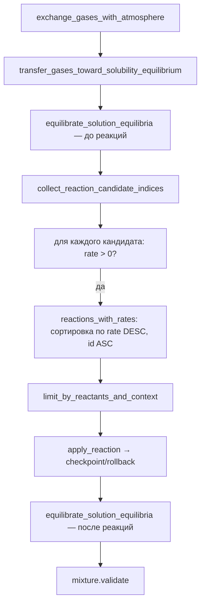

# Simulation — тиковая симуляция химических реакций

Исходный код: `core/simulation.rs`

## Назначение

Реализует пошаговую (per-tick) и итерационную (до равновесия) симуляцию реакций в [[core-mixture|Mixture]]. Управляет скоростями, ограничением по реагентам, применением реакций, тепловым эффектом, checkpoint/rollback и обменом газов с атмосферой.

## Ключевые типы

`ReactionContext` — изменяемый контекст тика: UV-мощность, мощность по спектральным диапазонам, внешние реагенты/катализаторы/продукты, каталитические поверхности (`CatalystSurfaceState`), результаты реакций и шаги поверхности.

`GasAtmosphere` — открытая атмосфера: мольные доли газов, давление (Па), коэффициент обмена за тик.

`SimulationReport` — итог `react_until_equilibrium`: число тиков, флаг равновесия, накопленные внешние продукты, состояния поверхностей.

`ReactionApplication` (приватный) — результат одного применения: `max_concentration_delta` и `thermal_changed`. Определяет, считается ли тик «изменившимся».

`ContextCheckpoint` (приватный) — снимок изменяемых полей `ReactionContext` для rollback при ошибке.

Константы: `TICKS_PER_SECOND = 20.0`, `EQUILIBRIUM_EPSILON_MOL_PER_BUCKET = TRACE_CONCENTRATION_MOL_PER_BUCKET`.

## Публичные входы

`react_for_tick(registry, mixture, cycles)` — выполняет `cycles` под-циклов за один тик без контекста.

`react_for_tick_with_context(registry, mixture, context, cycles)` — основная функция тика.

`react_until_equilibrium(registry, mixture, max_ticks, cycles_per_tick)` → `SimulationReport`.

`react_until_equilibrium_with_context(...)` — то же с явным контекстом.

`reaction_rate_mol_per_bucket_per_tick(registry, mixture, reaction)` — публичный расчёт скорости.

`reaction_rate_mol_per_bucket_per_tick_with_context(...)` — с контекстом.

## Поток данных / Алгоритм (один под-цикл)

### Расчёт скорости (`reaction_rate_mol_per_bucket_per_tick`)

1. Базовая скорость: Аррениус / сумма каналов → делится на `TICKS_PER_SECOND`.
2. `redox_environment_allows_reaction` — проверяет pH-среду по аннотации redox (Acidic/Basic/Neutral).
3. Умножается на `reaction_thermodynamic_rate_factor` (термодинамическое торможение по Gibbs/Keq).
4. Умножается на `redox_thermodynamic_rate_factor` (потенциал Нернста).
5. `evaluate_reaction_conditions` — если условие нарушено: rate = 0; иначе умножается на `multiplier`.
6. UV: `rate *= context.uv_power` если `requires_uv`.
7. Умножается на `reaction_selectivity_rate_factor` (Аррениус-дельта от SelectivityEngine).
8. `surface_rate_factor` — произведение `(free_sites / total_sites)` по всем поверхностям.
9. Произведение `concentration^order` по всем orders (по фазам из `phase_access`).

### Ограничение и применение

`limit_by_reactants_and_context` — берёт `min(rate, available/coeff)` по всем реагентам в смеси и внешним реагентам контекста; затем `limit_by_surfaces`.

`apply_reaction` сохраняет checkpoint смеси и контекста, вызывает `apply_reaction_inner`. При ошибке — восстанавливает оба.

`apply_reaction_inner`:
- Выбирает продукты: каналы (взвешенные по `rate_weight`) / распределение / прямые.
- `mixture.apply_reaction_phase_deltas_by_index` — изменяет концентрации.
- Уменьшает внешние реагенты, начисляет внешние продукты.
- Выполняет `surface_steps` (adsorb/desorb/poison/restore).
- `mixture.heat(-ΔH * 1000 * moles)` — тепловой эффект.

## Инварианты и ошибки

- `cycles > 0`, иначе `InvalidMixtureState`.
- Рассчитанная скорость должна быть конечной и ≥ 0.
- Внешний реагент не может стать отрицательным после применения.
- Если ни один канал недоступен — `InvalidReaction`.
- Поверхность без достаточно свободных сайтов → ошибка adsorb/desorb/poison.
- `GasAtmosphere`: фракции ≥ 0, сумма ≤ 1 + 1e-12, давление ≥ 0.
- `uv_power` и `power` для всех диапазонов ≥ 0.

## Связи

- [[core-mixture|Mixture]] — основной мутируемый объект.
- [[core-reaction|Reaction]] — источник кинетических параметров и стехиометрии.
- [[core-registry|Registry]] — индексы кандидатов, indexed reactions.
- [[core-condition|Condition]] — `evaluate_reaction_conditions` вызывается внутри rate.
- [[core-kinetics|Kinetics]] — `channel_rate_sum_per_second`, `LightBand`.
- [[core-redox|Redox]] — `evaluate_redox_potential`, `RedoxEnvironment`.
- [[core-solution|Solution]] — `equilibrate_solution_equilibria` дважды за под-цикл.
- [[selectivity-engine|SelectivityEngine]] — `SelectivityContext`, `evaluate_profile`.
