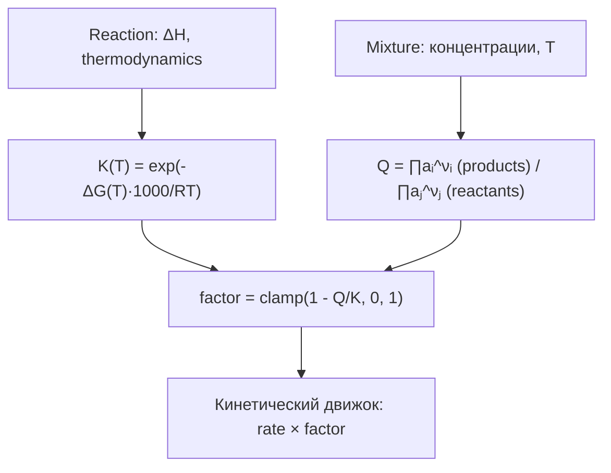

# Thermodynamics — термодинамика реакций

Исходный код: `core/thermodynamics.rs`

## Назначение

Связывает термохимические данные реакций (ΔG°, константа равновесия K) с
текущим состоянием [[core-mixture|смеси]], чтобы вычислить, насколько реакция
термодинамически продвинулась относительно равновесия. Итог — скалярный
коэффициент `[0, 1]`, которым кинетический движок масштабирует скорость.

## Ключевые типы

### `ReactionThermodynamics`

```rust
pub struct ReactionThermodynamics {
    pub reference_temperature_kelvin: f64,
    pub gibbs_free_energy_change_kj_per_mol: f64,
}
```

Хранит ΔG° при опорной температуре. Из него выводятся:

- ΔS через `entropy_change_j_per_mol_kelvin(ΔH)` — предполагается, что ΔH и ΔS
  не зависят от T (приближение Кирхгофа первого порядка);
- ΔG(T) через `gibbs_free_energy_change_at_kelvin(ΔH, T)`;
- K(T) через `equilibrium_constant_at_kelvin(ΔH, T)`.

## Публичные входы

### Конструкторы `ReactionThermodynamics`

| Метод | Входные данные |
|---|---|
| `from_gibbs_free_energy_change_kj_per_mol(ΔG)` | ΔG при 298.15 K |
| `from_gibbs_free_energy_change_at_kelvin(ΔG, T)` | ΔG при произвольной T |
| `from_equilibrium_constant(K)` | K при 298.15 K; ΔG вычисляется как −RT ln K |
| `from_equilibrium_constant_at_kelvin(K, T)` | K при произвольной T |

Все конструкторы через константу проверяют K > 0 и конечность.

### `equilibrium_constant_from_delta_g(ΔG, T)` (pub fn)

`K = exp(−ΔG·1000 / (R·T))`. Результат валидируется на K > 0.

### `delta_g_from_equilibrium_constant(K, T)` (pub fn)

Обратная функция: `ΔG = −RT ln(K) / 1000` (результат в кДж/моль).

### `reaction_thermodynamic_rate_factor(registry, mixture, reaction)`

Главная функция модуля. Алгоритм:

1. Если у реакции нет `thermodynamics` — возвращает `1.0` (без торможения).
2. Вычисляет K(T_смеси) по `ΔH` реакции и текущей температуре смеси.
3. Вычисляет реакционное частное Q через `reaction_quotient`.
4. Возвращает `clamp(1 − Q/K, 0, 1)`.

При Q = 0 фактор = 1 (реакция беспрепятственна). При Q ≥ K фактор = 0
(равновесие достигнуто или перейдено, реакция остановлена).

### `reaction_quotient(registry, mixture, reaction)`

Вычисляет Q = (произведение активностей продуктов) / (произведение активностей
реагентов). Использует `mixture.activity_of()` из [[core-solution|solution]].
Активность возводится в степень стехиометрического коэффициента. Если
знаменатель ≤ `1e-30`, возвращает `+∞` (реакция идёт вперёд без торможения).

Реакции с несколькими каналами (`channels`) или `product_distribution` не
поддерживаются — возвращается ошибка.

## Поток данных



## Инварианты и ошибки

- `InvalidMixtureState` при нефинитных ΔG, ΔH или T ≤ 0;
- `InvalidReaction` при попытке вычислить Q для реакции с каналами;
- `InvalidReaction` если Q/K не финитно или отрицательно;
- `QUOTIENT_ACTIVITY_FLOOR = 1e-30` — порог активности, ниже которого слагаемое
  считается нулём; это предотвращает log(0) при исчезающе малых концентрациях.
- `STANDARD_TEMPERATURE_KELVIN = 298.15` К — стандартная опорная температура.

## Связи

- [[core-reaction|Reaction]] — хранит `ReactionThermodynamics` и `enthalpy_change_kj_per_mol`
- [[core-mixture|Mixture]] — предоставляет T и `activity_of`
- [[core-kinetics|Kinetics]] — использует `reaction_thermodynamic_rate_factor` как множитель скорости
- [[core-solution|Solution]] — реализует `activity_of`, которую здесь вызывают
