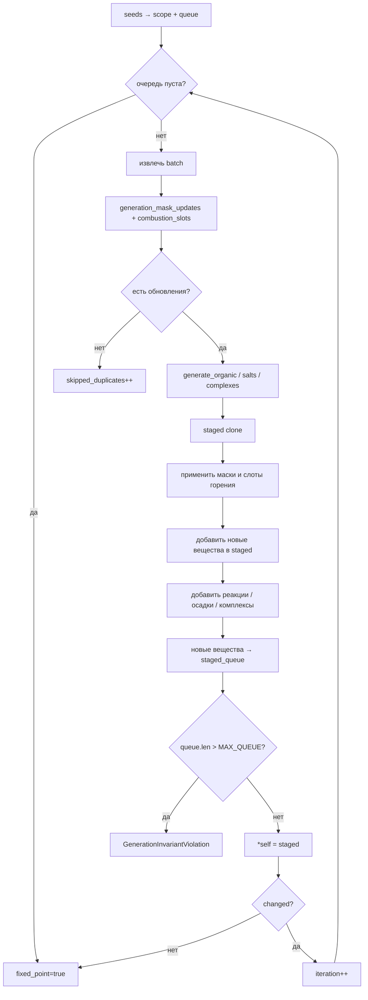

# Динамический реестр химии

Исходный код: `chemistry/dynamic/mod.rs`

## Назначение

`DynamicChemistryRegistry` — центр динамического слоя химии. Он оборачивает статический
[[core-registry|ChemistryRegistry]] и расширяет его веществами и реакциями, генерируемыми
на лету по структурным правилам. Позволяет разрешать FROWNS-коды в идентификаторы веществ,
строить неорганические соли и комплексы, запускать движок органических реакций и
планировщик синтеза — без предварительного знания полного пространства веществ.

## Ключевые типы

### DynamicChemistryRegistry

Главная структура. Хранит:

- `static_registry` — исходный [[core-registry|ChemistryRegistry]] (статические вещества и реакции)
- `dynamic_substances` / `dynamic_reactions` — накопленные динамические сущности
- `canonical_to_id` / `canonical_by_id` — двусторонний кеш FROWNS ↔ `SubstanceId`
- `site_index` — бакеты реактивных сайтов (`SiteBucket`) для быстрого поиска по `ReactiveSiteKind`
- `site_handles_by_substance` — индекс сайтов по слоту вещества
- `processed_generation_masks` — битовая маска `(slot, ReactiveSiteKey) → u64`; отслеживает,
  какие генераторы уже обработаны для данного реактивного сайта
- `processed_combustion_slots` — отдельный набор слотов для реакций горения
- `dynamic_acid_base_specs`, `dynamic_precipitation_specs`, `dynamic_complex_specs`

### KnownSubstanceIndex

```rust
enum KnownSubstanceIndex {
    Static(SubstanceIndex),
    Dynamic(usize),
}
```

Единый адрес вещества в объединённом пространстве. Линейный слот вычисляется как
`static_count + dynamic_index` для динамических веществ.

### OrganicGeneratorKind

Перечисление 63 генераторов (0..62), каждый кодируется одним битом в `u64`-маске.
Хранится в 1 байте (`size_of` проверяется тестом). Порядковые номера стабильны;
добавление нового генератора не должно сдвигать существующие.

### DynamicGenerationReport

Отчёт, возвращаемый публичными методами генерации:

| Поле | Смысл |
|---|---|
| `iterations` | Число итераций цикла |
| `added_substances` | Новые динамические вещества |
| `added_reactions` | Новые динамические реакции |
| `processed_work_items` | Обработанных элементов очереди |
| `skipped_duplicates` | Пропущено повторных попыток |
| `remaining_queue` | Осталось в очереди (> 0 при достижении `max_iterations`) |
| `reached_fixed_point` | Очередь исчерпана без обрыва |

## Публичные входы

| Метод | Описание |
|---|---|
| `from_destroy_catalog()` | Строит реестр из статического каталога Destroy |
| `from_registry(registry)` | Оборачивает произвольный `ChemistryRegistry` |
| `to_registry()` | Экспортирует всё обратно в `ChemistryRegistry` |
| `resolve_frowns(code)` | Разбирает FROWNS, возвращает `SubstanceId`; создаёт динамическое вещество если нужно |
| `resolve_structure(structure)` | То же, но принимает уже разобранную `MolecularStructure` |
| `substance(id)` | Ищет вещество сначала в динамическом, затем в статическом реестре |
| `reaction(id)` | Аналогично для реакций |
| `substances()` | Итератор: статические + динамические |
| `reactions()` | Итератор: статические + динамические |
| `reaction_candidates_for_substances(ids)` | Все реакции, в которых участвует хотя бы одно из веществ |
| `validate_substance_can_enter_mixture(id)` | Ошибка если вещество помечено тегом `destroy:hypothetical` |
| `generate_reactions_for(id, max_iter)` | Генерация от одного вещества, не более `max_iter` итераций |
| `generate_reactions_for_to_fixed_point(id)` | То же, до фиксированной точки |
| `generate_reactions_for_substances(ids, max_iter)` | Несколько начальных веществ |
| `generate_reactions_for_substances_to_fixed_point(ids)` | То же, до фиксированной точки |
| `generate_reactions(max_iter)` | Полное пространство, ограниченное итерациями |
| `generate_to_fixed_point()` | Полное пространство до фиксированной точки |

## Поток данных / Алгоритм

### resolve_frowns / resolve_structure

1. Разобрать FROWNS → `MolecularStructure`
2. Записать каноническую форму через `write_frowns`
3. Если каноническая форма уже известна — вернуть существующий `SubstanceId`
4. Иначе — создать динамическое вещество через `build_dynamic_substance`, добавить в реестр

### generate_reactions_from_scope (главный цикл)



Ключевые аварийные ограничения:
- `MAX_DYNAMIC_WORK_ITEMS = 1_000_000` — суммарное число обработанных элементов
- `MAX_DYNAMIC_QUEUE_ITEMS = 100_000` — длина очереди в любой момент
- `MAX_DYNAMIC_ATOMS = 100` — размер динамического вещества

### Ключи заданий и маски генераторов

Для каждой пары `(slot, ReactiveSiteKey)` хранится `u64`-битовая маска.
Каждый `OrganicGeneratorKind` занимает ровно один бит (ordinal 0..62).
Вещество обрабатывается повторно, только если маска изменилась — т.е. появились
реактивные сайты или добавились генераторы, ещё не запущенные для данного сайта.

Горение хранится отдельно в `processed_combustion_slots` (бит не нужен, достаточно
факта присутствия слота).

### Неорганические соли и комплексы

Генерируются при обнаружении ионов в области `scope`:
- **соль**: подбираются все пары катион/анион с противоположным знаком заряда;
  стехиометрия — через НОД зарядов; `solubility_product` оценивается эмпирически
  по произведению зарядов
- **комплекс**: металл Cu/Ni/Zn/Fe + лиганд (NH₃, CN⁻, Cl⁻, OH⁻);
  координационное число из `preferred_coordination_number / denticity`;
  константа устойчивости — `10^(charge × field_strength × count / 2)`, clamp [1, 32]

### Оценка фазовых свойств динамического вещества

`estimate_dynamic_phase_profile` вычисляет:
- `polarity_score` — взвешенная сумма заряда, HBD/HBA, гетероатомов, галогенов, C
- `estimated_log_P` — приближённый раздел октанол/вода
- `solid_forming_tendency` — склонность к образованию твёрдой фазы

На основе профиля выбирается `LiquidPhasePreference` (Aqueous / Organic) и растворимости.

### Сопряжённые основания

При добавлении нового вещества автоматически создаётся сопряжённое основание для каждой
функциональной группы типа `CarboxylicAcid` (pKₐ = 4.8) или `BoricAcid` (pKₐ = 9.2):
депротонирование через `MolecularEditor`, регистрация `AcidBaseSpec`.

## Инварианты и ошибки

- Каноническая форма FROWNS уникальна для каждого вещества; одинаковые структуры всегда
  дают один и тот же `SubstanceId` (тест `creates_stable_dynamic_substance_without_duplicates`)
- Стереоизомеры различаются (`dynamic_substances_distinguish_stereoisomers`)
- `Stereochemistry::Mixture` не может быть самостоятельным веществом — генераторы обязаны
  распределять продукты по конкретным стереоизомерам
- Вещества с атомом `R` помечаются тегом `destroy:hypothetical` и не могут входить в смесь
- Заряд и масса проверяются при каждом добавлении реакции (`validate_dynamic_reaction`);
  отклонение массы > `MASS_TOLERANCE_GRAMS_PER_MOL = 1e-6` приводит к `MassNotConserved`
- Дубликаты вещества → `DuplicateSubstance`; дубликаты реакции → `DuplicateReaction`
- Превышение `MAX_DYNAMIC_WORK_ITEMS` или `MAX_DYNAMIC_QUEUE_ITEMS` →
  `GenerationInvariantViolation`

## Связи

- [[core-registry|ChemistryRegistry]] — статический реестр внутри `DynamicChemistryRegistry`
- [[molecule-frowns|FROWNS]] — парсинг/запись молекулярных структур
- [[molecule-reactive-site|ReactiveSite]] — ключи генерации и бакеты сайтов
- [[organic-engine|organic]] — `generate_organic_reactions_for_seed_substances`
- [[core-solution|PrecipitationSpec, AcidBaseSpec]] — динамические осадки и кислоты
- [[core-complex|ComplexSpec]] — динамические координационные соединения
- [[core-kinetics|EnergyModel]] — хранится внутри реестра, передаётся вместе с ним
- [[synthesis|SynthesisPlanner]] — использует `DynamicChemistryRegistry` как источник реакций

