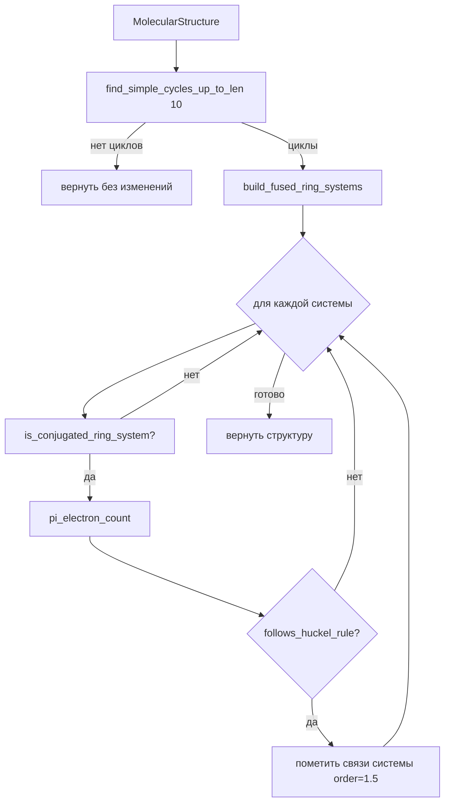

# Ароматическое восприятие

Исходный код: `molecule/aromatic_perception.rs`

## Назначение

Преобразует чередующиеся одинарные/двойные связи в кольцах в ароматические связи (order 1.5) на основе критерия Хюккеля. Вызывается автоматически при финализации молекулы (`StructureBuilder::finish`, `MolecularEditor::finish`).

Функция идемпотентна: повторное применение к уже ароматизированной молекуле не меняет результат.

## Ключевые типы

### RingSystem (internal)

```rust
struct RingSystem {
    atoms: BTreeSet<usize>,
    bonds: BTreeSet<(usize, usize)>,
    cycles: Vec<Vec<usize>>,
}
```

Сочленённые циклы (sharing bond) объединяются в одну систему через DisjointSet.

### DisjointSet (internal)

Union-Find с rank-эвристикой и path compression — для объединения циклов в кольцевые системы.

## Публичные входы

```rust
pub fn aromatize(mut structure: MolecularStructure) -> ChemistryResult<MolecularStructure>
```

## Поток данных / Алгоритм



### Поиск циклов

DFS от каждой стартовой вершины, ограничение длины 10. Дедупликация: каждый цикл представляется отсортированным набором вершин. Только соседи с индексом ≥ start рассматриваются при закрытии цикла (избегает зеркальных дублей).

### Конъюгированность системы

`is_conjugated_ring_system` проверяет, что каждый атом системы имеет p-орбиталь:

- Если атом участвует в эндоциклической π-связи (order ≥ 1.5) → принимаются C, N, O, S, B, P
- Иначе:
  - `C`: только при заряде ±1 (карбкатион/карбанион)
  - `N`: нейтральный с ≥2 кольцевыми соседями, или N⁻
  - `O`, `S`: нейтральные с ≥2 кольцевыми соседями
  - `B`: нейтральный с ≥2 кольцевыми соседями (пустая p-орбиталь)

### Счёт π-электронов

| Атом | Условие | Вклад |
|------|---------|-------|
| C | заряд +1 | 0 |
| C | заряд -1, нет эндоцикл. π | 2 |
| C | иначе | 1 |
| N | заряд +1 | 1 |
| N | с эндоциклической π | 1 |
| N | нейтральный или -1 | 2 |
| O, S | с эндоциклической π | 1 |
| O, S | нейтральный | 2 |
| B | нейтральный или +1 | 0 |

### Правило Хюккеля

`follows_huckel_rule(n)` ↔ `n >= 2 && (n-2) % 4 == 0` (т.е. n = 2, 6, 10, 14, …)

## Инварианты и ошибки

- Циклы длиной > 10 атомов игнорируются (не ароматизируются).
- Si и другие не-органические гетероатомы не получают p-орбиталь → кольца с Si не ароматизируются.
- Циклобутадиен (4 π e⁻) и COT (8 π e⁻) правильно **не** ароматизируются.
- Пирролил-анион (6 π e⁻), тропилий-катион (6 π e⁻) — ароматизируются.
- Функция не бросает ошибок при нормальном вводе; `ChemistryResult` для совместимости с цепочкой вызовов.

## Связи

- [[molecule-graph|Граф молекулы]] — `MolecularStructure`, вызывается из `MolecularEditor::finish`
- [[molecule-frowns|FROWNS]] — `parse_frowns` вызывает `aromatize` в обоих путях парсинга
- [[molecule-functional-group|Функциональные группы]] — получает уже ароматизированную структуру
