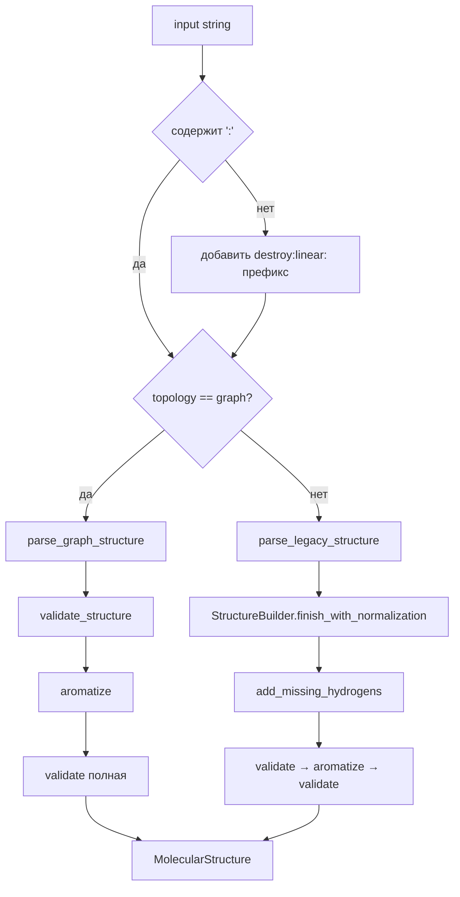

# Формат FROWNS и его парсинг

Исходный код: `molecule/frowns.rs`

## Назначение

Точка входа для разбора молекулярных строк и сериализации молекул обратно в канонический код. Единый интерфейс для всех форматов FROWNS. `write_frowns` является псевдонимом `canonical_structure_code`.

## Формат FROWNS

Общая структура: `<namespace>:<topology>:<body>`

Примеры:
```
destroy:linear:CC(=O)O           # уксусная кислота (линейный)
destroy:benzene:C,,,,,           # толуол (топологический)
destroy:graph:atoms=C.C.O;bonds=0-s-1,1-s-2   # явный граф
CCO                              # краткая запись → destroy:linear:CCO
```

### Линейный формат (linear)

SMILES-подобный: `C`, `CC`, `C(=O)O`, `C#N`, `C~C` (ароматическая связь), `R2` (R-группа), `C^-1` (заряд).

### Топологический формат (topology)

`<namespace>:<shape>:<group1>,<group2>,...` — встроенные шаблоны колец:

| Ключевое слово | Структура |
|----------------|-----------|
| `benzene` | 6-членное кольцо C, order 1.5 |
| `cubane` | кубан (8C) |
| `cyclohexene` | циклогексен |
| `cyclopentadienide` | анион Cp⁻ |
| `diborane` | дибор с мостиковыми H (order 0.5) |
| `octasulfur` | S₈ кольцо |
| `tetraborate` | тетраборат |
| `anthracene/anthraquinone` | 14C сочлённая ароматика |
| `isohydrobenzofuran` | бензофуран |

### Graph формат (graph)

```
destroy:graph:atoms=<el1>.<el2>...;bonds=<i>-<ord>-<j>,...[;stereo=<token>,...]
```

Порядки связей: `s`=1, `d`=2, `t`=3, `a`=1.5, или числами `1`/`2`/`3`/`1.5`.

Стереохимия:
```
t:<center>:<s0>.<s1>.<s2>.<s3>:<cw|ccw>      # тетраэдрический центр
db:<a>=<b>:<sub1>-<sub2>:<cis|trans|e|z>      # двойная связь
mix:<tetra|db|general>:<a0>.<a1>...           # смесь стереоизомеров
```

## Публичные входы

```rust
pub fn parse_frowns(input: &str) -> ChemistryResult<MolecularStructure>
pub fn write_frowns(structure: &MolecularStructure) -> ChemistryResult<String>
pub fn canonical_structure_code(structure: &MolecularStructure) -> ChemistryResult<String>
```

## Поток данных / Алгоритм



**Двухфазная валидация для graph-формата:** сначала `validate_structure` (структурная целостность, без валентности) — чтобы поймать битые индексы до ароматизации; затем полная `validate` после `aromatize`.

**Восстановление водородов:** происходит только в `legacy`/`linear`/`topology` пути через `add_missing_hydrogens`. В `graph`-формате водороды должны быть указаны явно в списке атомов.

## Инварианты и ошибки

- Пустая строка → ошибка.
- Несбалансированные скобки → ошибка (`validate_branch_balance` перед парсингом).
- Одно двоеточие без трёх частей → ошибка.
- Индекс атома ≥ `atom_count` в bonds → ошибка (до aromatize).
- Неизвестный топологический ключ → ошибка.
- `write_frowns` производит детерминированный канонический код — идентичные молекулы дают одну строку.

## Связи

- [[molecule-graph|Граф молекулы]] — `MolecularStructure`, `MolecularAtom`, `MolecularBond`, `parse_legacy_structure`
- [[molecule-canonical|Канонизация]] — делегирует `canonical_structure_code`
- [[molecule-aromatic-perception|Ароматическое восприятие]] — вызывает `aromatize`
